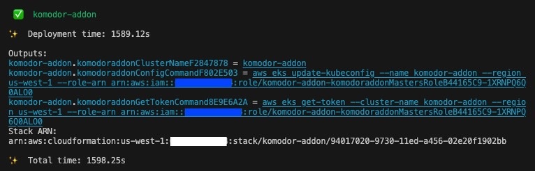

# Komodor Amazon EKS Blueprints Addon

> **This project is currently in Beta**

## Overview

This is an add-on to the [Amazon EKS Blueprints for CDK](https://github.com/aws-quickstart/cdk-eks-blueprints) project. The [CDK](https://aws.amazon.com/cdk/) code in this repository can be used to quickly deploy an [Amazon EKS](https://aws.amazon.com/eks/) cluster with the [Komodor Agent](https://github.com/komodorio/helm-charts/tree/master/charts/k8s-watcher) installed out of the box. Additionally, EKS Blueprints users can add this module as a dependency in their project. This allows them to install the Komodor Agent using CDK code and manage its configuration using GitOps.

## Prerequisites

_Skip this section and go [here](#existing-amazon-eks-blueprints-project) if you want to use this addon in an existing EKS Blueprints project._

Instructions are provided for MacOS. For Linux and Windows please consult documentation how to install the required components (`make`, `nodejs`).

1. Install Make on Mac.

```
brew install make
```

2. Install Node.js.

```
brew install node
```

Make sure that the installed Node.js version is compatible with CDK. More information can be found [here](https://docs.aws.amazon.com/cdk/latest/guide/getting_started.html#:~:text=All%20AWS%20CDK,a%20different%20recommendation.) (scroll to the "Prerequisites" section).

3. Install [AWS CLI](https://docs.aws.amazon.com/cli/latest/userguide/getting-started-install.html) and provide credentials by running `aws configure`.

4. In order to avoid problems with CDK version potentially being different from the version used by EKS Blueprints, create a local alias for CDK (as opposed to system wide installation). For that include the following alias to your ~/.bashrc or ~/.zshrc file:

```
alias cdk="npx cdk"
```

Make sure you run `source ~/.bashrc` after editing the file.

Example for mac/linux terminal:

```
$ echo 'alias cdk="npx cdk"' >> ~/.zshrc
$ source ~/.zshrc
```

5. Clone this git repository

```
git clone https://github.com/komodorio/komodor-eks-blueprints-addon.git
cd komodor-eks-blueprints-addon
```

## Installation

The CDK code in this repository can be used to deploy a new Amazon EKS cluster with the Komodor Agent built-in. Alternatively, the node module released from this repository can be used as a dependency in existing EKS Blueprints projects to integrate the Komodor Agent.

### New Amazon EKS Cluster

1. Run `npm install`.

2. Configure the required values in `<project>/bin/main.ts`.

3. Run `make build && make lint && make list` to build.

4. Run `make synth` to synthesize and print the Cloudformation template.

5. Run `cdk bootstrap` to deploy the CDK toolkit stack into the AWS environment.

6. Run `cdk deploy` to deploy to AWS.

7. Connect to the EKS cluster by using the `aws eks` commands in the stack outputs:



8. Congratulations! You deployed and connected to an EKS cluster running Komodor Agent. You can go to your Komodor account and see that you are connected to the cluster and can view all the resources.

### Existing Amazon EKS Blueprints Project

1. Add this module as a dependency:

```
npm install @komodor/komodor-eks-blueprints-addon
```

2. Use it as follows:

```js
import * as cdk from "aws-cdk-lib";
import * as blueprints from "@aws-quickstart/eks-blueprints";
import { KomodorAddOn } from "@komodorio/komodor-eks-blueprints-addon";

const app = new cdk.App();

const account = "<account id>";
const region = "<region>";
const clusterName = "<cluster name>";
const props = { env: { account, region } };

const addOns: Array<blueprints.ClusterAddOn> = [
  new KomodorAddOn({
    apiKey: "<api key>",
    clusterName: clusterName,
    values: {}, // additional Helm chart values
  }),
];

new blueprints.EksBlueprint(app, { id: clusterName, addOns }, props);
```

## AddOn Options

| Option                 | Description                                                                                                                                                    | Default                                                                 |
| ---------------------- | -------------------------------------------------------------------------------------------------------------------------------------------------------------- | ----------------------------------------------------------------------- |
| `apiKey`               | Your Komodor API key                                                                                                                                           | ""                                                                      |
| `apiKeyExistingSecret` | Existing k8s Secret storing the API key                                                                                                                        | ""                                                                      |
| `apiKeyAWSSecret`      | Secret in AWS Secrets Manager storing the API key                                                                                                              | ""                                                                      |
| `clusterName`          | Name of the EKS cluster you wish to create                                                                                                                     | ""                                                                      |
| `namespace`            | Namespace where to install the Komdor Agent                                                                                                                    | "default"                                                               |
| `version`              | Version of the Komodor Agent Helm chart                                                                                                                        | "1.3.4"                                                                 |
| `release`              | Name of the Helm release                                                                                                                                       | "k8s-watcher"                                                           |
| `repository`           | Repository of the Helm chart                                                                                                                                   | "https://helm-charts.komodor.io"                                        |
| `values`               | Configuration values passed to the chart, options are documented [here](https://github.com/komodorio/helm-charts/tree/master/charts/k8s-watcher#configuration) | { "watcher.actions.basic": "true", "watcher.actions.advanced": "true" } |
